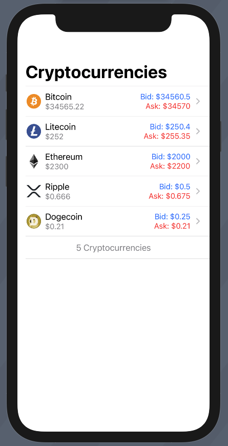

# iOS Crypto WebSocket Client

A work-in-progress sample iOS app using WebSockets to provide live prices for cryptocurrencies in a list and detailed view.  

## To do list
- [X] Create list view with test data
- [ ] Hook up to WebSocket API
- [ ] Format for the correct tick size ($250.5 -> $250.50), requires tick size from the API because there are cryptocurrencies with a ticket size > 2
- [ ] Create detailed view with test data
- [ ] Loading list on first time behaviour
- [ ] Reloading list behaviour (swipe down to reload, loading indicator)
- [ ] Handle error from the network
- [ ] List search (Swipe down to reveal search, like in the iOS settings app)
- [ ] Filtering and sorting
- [ ] Last updated timestamp

## Screenshots
### List view with test data

